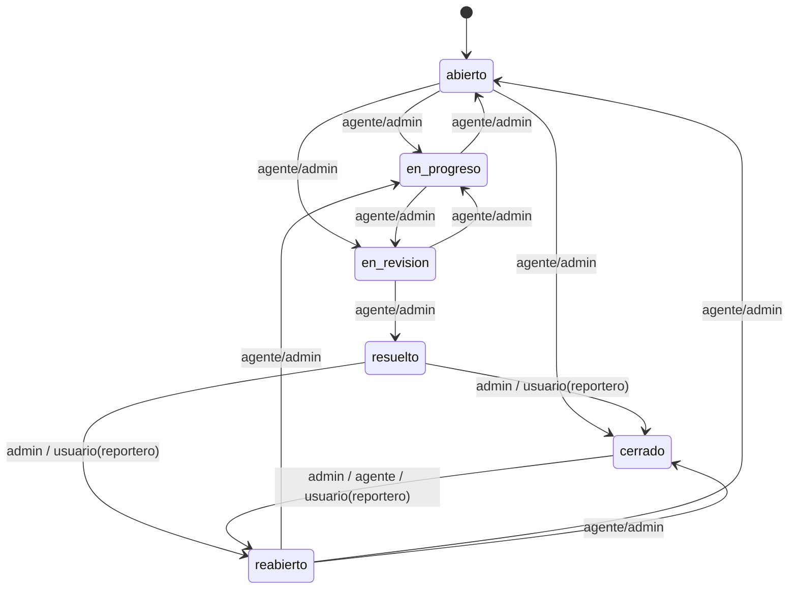

# Máquina de estados de Tickets (Patrón State)

Diseño de la máquina de estados para el ciclo de vida del ticket. El backend
(NestJS) la implementa fielmente; el frontend solo consume las transiciones
permitidas vía `GET /tickets/:id/transitions` y pinta botones en consecuencia.

---

## 1. Estados

`TicketStateValue` (debe coincidir con el enum Prisma `TicketState`):

```
abierto | en_progreso | en_revision | resuelto | cerrado | reabierto
```

Estado inicial por defecto: **`abierto`**.

---

## 2. Interfaz `TicketState`

```ts
import type {Role, TicketStateValue} from '@ticketera/types';

export interface TransitionGuardContext {
  /** Rol global del actor (admin | agente | usuario). */
  actorRole: Role;
  /** ID del usuario que ejecuta la transición. */
  actorId: string;
  /** ID del creador del ticket (reporter). */
  reporterId: string;
}

export interface TicketState {
  readonly value: TicketStateValue;
  /** Lista de estados destino permitidos para este estado (sin considerar rol). */
  readonly allowedTargets: readonly TicketStateValue[];
  /**
   * Indica si `actor` puede transicionar desde este estado hacia `target`.
   * Implementa los guardas por rol.
   */
  canTransitionTo(target: TicketStateValue, ctx: TransitionGuardContext): boolean;
}
```

---

## 3. Estados concretos

Cada estado es una clase que implementa `TicketState`. La lista
`allowedTargets` es la definición estructural; `canTransitionTo` aplica los
guardas por rol. `admin` siempre puede (puede forzar cualquiera).

```ts
class AbiertoState implements TicketState {
  readonly value = 'abierto' as const;
  readonly allowedTargets = ['en_progreso', 'en_revision', 'cerrado'] as const;

  canTransitionTo(target: TicketStateValue, ctx: TransitionGuardContext): boolean {
    if (ctx.actorRole === 'admin') return true;
    if (ctx.actorRole === 'agente') return this.allowedTargets.includes(target);
    return false; // usuario no puede mover 'abierto'
  }
}

class EnProgresoState implements TicketState {
  readonly value = 'en_progreso' as const;
  readonly allowedTargets = ['en_revision', 'abierto'] as const;
  canTransitionTo(target: TicketStateValue, ctx: TransitionGuardContext): boolean {
    if (ctx.actorRole === 'admin') return true;
    if (ctx.actorRole === 'agente') return this.allowedTargets.includes(target);
    return false;
  }
}

class EnRevisionState implements TicketState {
  readonly value = 'en_revision' as const;
  readonly allowedTargets = ['resuelto', 'en_progreso'] as const;
  canTransitionTo(target: TicketStateValue, ctx: TransitionGuardContext): boolean {
    if (ctx.actorRole === 'admin') return true;
    if (ctx.actorRole === 'agente') return this.allowedTargets.includes(target);
    return false;
  }
}

class ResueltoState implements TicketState {
  readonly value = 'resuelto' as const;
  readonly allowedTargets = ['cerrado', 'reabierto'] as const;
  canTransitionTo(target: TicketStateValue, ctx: TransitionGuardContext): boolean {
    if (ctx.actorRole === 'admin') return true;
    // usuario solo si es el reportero del ticket
    if (ctx.actorRole === 'usuario') {
      return ctx.actorId === ctx.reporterId && this.allowedTargets.includes(target);
    }
    return false; // agente no mueve 'resuelto'
  }
}

class CerradoState implements TicketState {
  readonly value = 'cerrado' as const;
  readonly allowedTargets = ['reabierto'] as const;
  canTransitionTo(target: TicketStateValue, ctx: TransitionGuardContext): boolean {
    if (ctx.actorRole === 'admin') return true;
    if (ctx.actorRole === 'agente') return this.allowedTargets.includes(target);
    if (ctx.actorRole === 'usuario') {
      return ctx.actorId === ctx.reporterId && this.allowedTargets.includes(target);
    }
    return false;
  }
}

class ReabiertoState implements TicketState {
  readonly value = 'reabierto' as const;
  readonly allowedTargets = ['en_progreso', 'abierto', 'cerrado'] as const;
  canTransitionTo(target: TicketStateValue, ctx: TransitionGuardContext): boolean {
    if (ctx.actorRole === 'admin') return true;
    if (ctx.actorRole === 'agente') return this.allowedTargets.includes(target);
    return false;
  }
}
```

---

## 4. `TicketContext` (orquestador de transiciones)

El contexto mantiene el estado actual y delega la validación al estado concreto.
No conoce la lógica de cada estado; solo aplica `canTransitionTo`.

```ts
export class TicketContext {
  private state: TicketState;

  constructor(initial: TicketState) {
    this.state = initial;
  }

  get current(): TicketStateValue {
    return this.state.value;
  }

  /**
   * Devuelve las opciones de transición para un actor, marcando `allowed`
   * y un `reason` cuando no lo está.
   */
  optionsFor(ctx: TransitionGuardContext): TransitionOptionDto[] {
    return (Object.values(STATE_FACTORY) as TicketState[]).map((s) => {
      const target = s.value;
      if (target === this.state.value) {
        return {to: target, allowed: false, reason: 'misma_transicion'};
      }
      const allowed = this.state.canTransitionTo(target, ctx);
      return {
        to: target,
        allowed,
        reason: allowed ? undefined : 'rol_no_autorizado',
      };
    });
  }

  /**
   * Ejecuta la transición. Lanza AppError(TRANSITION_NOT_ALLOWED / INVALID_TRANSITION /
   * SAME_STATE_TRANSITION) si no es válida. Retorna el nuevo estado.
   * La persistencia (Ticket + TicketHistory) la hace el service en una transacción.
   */
  transitionTo(target: TicketStateValue, ctx: TransitionGuardContext): TicketState {
    if (target === this.state.value) {
      throw new AppError(ErrorCodes.SAME_STATE_TRANSITION, 'El ticket ya está en ese estado', 409);
    }
    if (!this.state.canTransitionTo(target, ctx)) {
      throw new AppError(
        ErrorCodes.TRANSITION_NOT_ALLOWED,
        'Rol no autorizado para esta transición',
        403,
      );
    }
    const next = STATE_FACTORY[target];
    if (!next) {
      throw new AppError(ErrorCodes.INVALID_TRANSITION, 'Transición inválida', 400);
    }
    this.state = next;
    return this.state;
  }
}

/** Mapa estado -> instancia concreta (singletons). */
export const STATE_FACTORY: Record<TicketStateValue, TicketState> = {
  abierto: new AbiertoState(),
  en_progreso: new EnProgresoState(),
  en_revision: new EnRevisionState(),
  resuelto: new ResueltoState(),
  cerrado: new CerradoState(),
  reabierto: new ReabiertoState(),
};
```

---

## 5. Tabla de transiciones y guardas por rol

| Desde → Hacia | admin | agente | usuario (reportero) |
|---------------|:-----:|:------:|:-------------------:|
| abierto → en_progreso | ✓ | ✓ | ✗ |
| abierto → en_revision | ✓ | ✓ | ✗ |
| abierto → cerrado | ✓ | ✓ | ✗ |
| en_progreso → en_revision | ✓ | ✓ | ✗ |
| en_progreso → abierto | ✓ | ✓ | ✗ |
| en_revision → resuelto | ✓ | ✓ | ✗ |
| en_revision → en_progreso | ✓ | ✓ | ✗ |
| resuelto → cerrado | ✓ | ✗ | ✓ (si reportero) |
| resuelto → reabierto | ✓ | ✗ | ✓ (si reportero) |
| cerrado → reabierto | ✓ | ✓ | ✓ (si reportero) |
| reabierto → en_progreso | ✓ | ✓ | ✗ |
| reabierto → abierto | ✓ | ✓ | ✗ |
| reabierto → cerrado | ✓ | ✓ | ✗ |

Reglas adicionales:
- `admin` puede forzar **cualquier** transición (incluidas las no listadas).
- `usuario` solo aparece con permiso en `resuelto`/`cerrado` y **solo si
  `actorId === reporterId`** (es el creador del ticket).
- Toda transición válida se persiste en `TicketHistory`.

---

## 6. Persistencia en `TicketHistory`

`TicketHistory` registra cada cambio de estado:

```
TicketHistory { id, ticketId, actorId, fromState, toState, createdAt }
```

El `TicketService.transition()` debe:
1. Cargar el ticket y resolver `reporterId` y `actorId`/`actorRole` del `RequestUser`.
2. Construir `TicketContext` con el estado actual y llamar `transitionTo(target, ctx)`.
3. Si pasa, ejecutar en **una transacción Prisma** (`$transaction`):
   - `ticket.update({ state: target })`
   - `ticketHistory.create({ ticketId, actorId, fromState, toState, createdAt })`
   - (opcional) crear `Notification` a reportero/asignado.
4. Devolver el `TicketDto` actualizado.

`fromState` es el estado antes del cambio; `toState` es `target`.

---

## 7. Enum Prisma sugerido

```prisma
enum TicketState {
  abierto
  en_progreso
  en_revision
  resuelto
  cerrado
  reabierto
}
```

Ya incluido en `apps/api/prisma/schema.prisma`. El campo `Ticket.state` usa
`@default(abierto)`.

---

## 8. Diagrama


